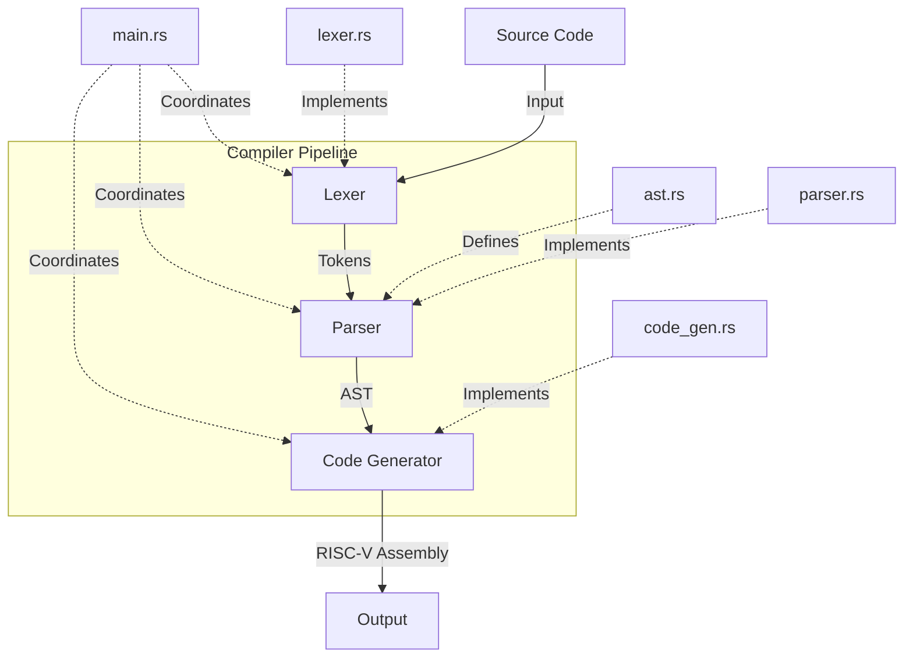

# Rust-RISCV-Compiler

A simple compiler written in Rust that targets the RISC-V architecture. This project implements a basic compiler pipeline including lexical analysis, parsing, abstract syntax tree (AST) generation, and code generation for a custom language.

## Project Structure

```
Rust-RISCV-Compiler/
│
├── src/
│   ├── main.rs       # Entry point of the compiler
│   ├── lexer.rs      # Tokenization of input source code
│   ├── parser.rs     # Parsing tokens into an AST
│   ├── ast.rs        # Abstract Syntax Tree definitions
│   └── code_gen.rs   # RISC-V code generation from AST
│
├── Cargo.toml        # Rust package manifest
├── Cargo.lock        # Rust dependency lock file
└── README.md         # This file
```

## Compiler Pipeline

The compiler follows a standard pipeline structure:



1. **Lexical Analysis (lexer.rs)**: Breaks down the input source code into a series of tokens.
2. **Parsing (parser.rs)**: Consumes the tokens and builds an Abstract Syntax Tree (AST).
3. **AST Representation (ast.rs)**: Defines the structure for the Abstract Syntax Tree.
4. **Code Generation (code_gen.rs)**: Traverses the AST and generates RISC-V assembly code.

## Building and Running

To build the project:

```bash
cargo build
```

To run the compiler:

```bash
cargo run -- <input_file>
```

Replace `<input_file>` with the path to your source code file.

## Language Features

Our custom language supports:

- Basic arithmetic operations
- Variable declarations and assignments
- Conditional statements (if/else)
- Loops (while)
- Function definitions and calls

(You can expand this section with more details about your language's syntax and features.)

## RISC-V Output

The compiler generates RISC-V assembly code. You can use a RISC-V simulator or emulator to run the generated code.

## Example

Here's a simple example of our language and its compilation process:

```
// Input: example.mylang
function main() {
    let x = 5;
    let y = 10;
    print(x + y);
}
```

Compilation:
```bash
cargo run -- example.mylang
```

This will produce RISC-V assembly output (example output):

```assembly
.globl main
main:
    addi sp, sp, -16
    li t0, 5
    sw t0, 0(sp)
    li t0, 10
    sw t0, 4(sp)
    lw t0, 0(sp)
    lw t1, 4(sp)
    add a0, t0, t1
    call print
    addi sp, sp, 16
    ret
```

## Contributing

Contributions are welcome! Please feel free to submit a Pull Request.

## License

This project is open source and available under the [MIT License](LICENSE).

## Future Improvements

- Implement more advanced language features (e.g., structs, enums)
- Add optimizations to the code generation phase
- Extend error reporting and recovery mechanisms
- Create a standard library for the custom language
